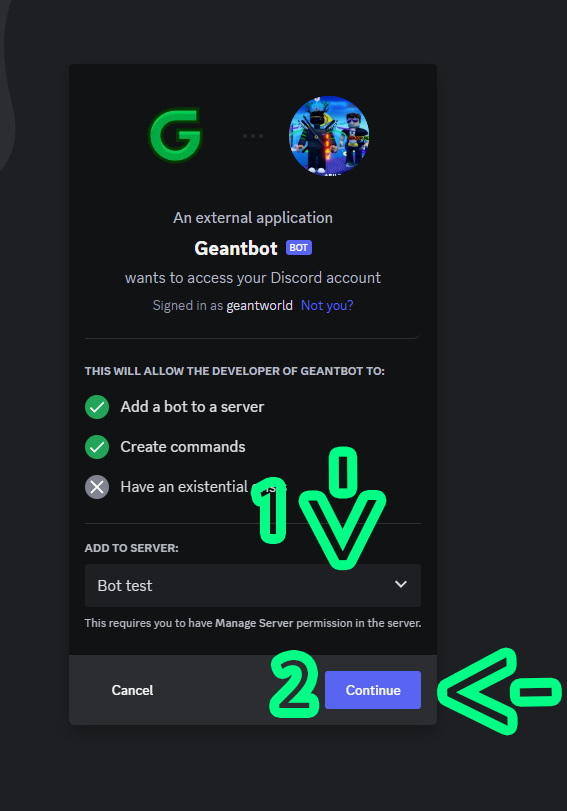

# 👋 Getting started

## Inviting Geantbot

First you need to go to [geantbot.xyz](https://geantbot.xyz) and click "Login".

<figure><figcaption>
Click on Login.
</figcaption></figure>

Then click on authorise and you'll be redirected to the dashboard.


If the website is in maintenance or down, you can directly invite the bot through [this link](https://discord.com/oauth2/authorize?client\_id=1135535911866740849\&permissions=8\&scope=bot%20applications.commands.permissions.update)


<figure><figcaption>
Click on Authorise.
</figcaption></figure>

Now it's time to add the bot to your server. Click on "Invite the bot" and select the server you wanna add the bot to (1) and click on "Continue" (2). Click on Authorise to invite the bot on you server.


Keep the administrator permission to **Geantbot** so it can work properly. You can also change **Geantbot's** permission by modifying its role permission after being invited.


<figure><figcaption>
Click on Invite the bot
</figcaption></figure>


If you have already got servers scroll down to the invite button


<figure><figcaption>
Select the server (1) and click on Continue (2)
</figcaption></figure>


Congratulation, you've successfully invited **Geantbot**!

